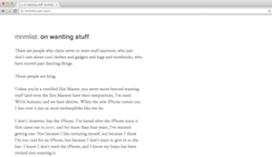

# mnmlist



This theme is a Jekyll-compatible version of Leo Babauta's [mnmlist theme](http://mnmlist.com/theme), used on his website [mnmlist.com](https://mnmlist.com). I claim no credit for this theme (although Babauta has said that he doesn't care).

mnmlist is a clean and very minimalist theme that focuses on the content without distractions. It has a single sidebar. No widgets. No comments. No search. No dynamic sidebar. No nothing.

This is v3 of the theme. In this version:

* fonts have been improved
* some other stuff has been stripped
* the archives is now on the main page (index page)
* it still has no sidebar, header, comments, widgets, etc.

## Installation

Add this line to your Jekyll site's Gemfile:

```ruby
gem "mnmlist"
```

And add this line to your Jekyll site's `_config.yml`:

```yaml
theme: mnmlist
```

And then execute:

    bundle

Or install it yourself as:

    gem install mnmlist


## Contributing

Bug reports and pull requests are welcome on GitHub at https://github.com/ErikBoesen/mnmlist. This project is intended to be a safe, welcoming space for collaboration, and contributors are expected to adhere to the [Contributor Covenant](http://contributor-covenant.org) code of conduct.

## Development

To set up your environment to develop this theme, run `bundle install`.

Your theme is setup just like a normal Jekyll site! To test your theme, run `bundle exec jekyll serve` and open your browser at `http://localhost:4000`. This starts a Jekyll server using your theme. Add pages, documents, data, etc. like normal to test your theme's contents. As you make modifications to your theme and to your content, your site will regenerate and you should see the changes in the browser after a refresh, just like normal.

When your theme is released, only the files in `_layouts`, `_includes`, and `_sass` tracked with Git will be released.

## License

Like the original, this theme is [uncopyrighted](http://mnmlist.com/uncopyright).
